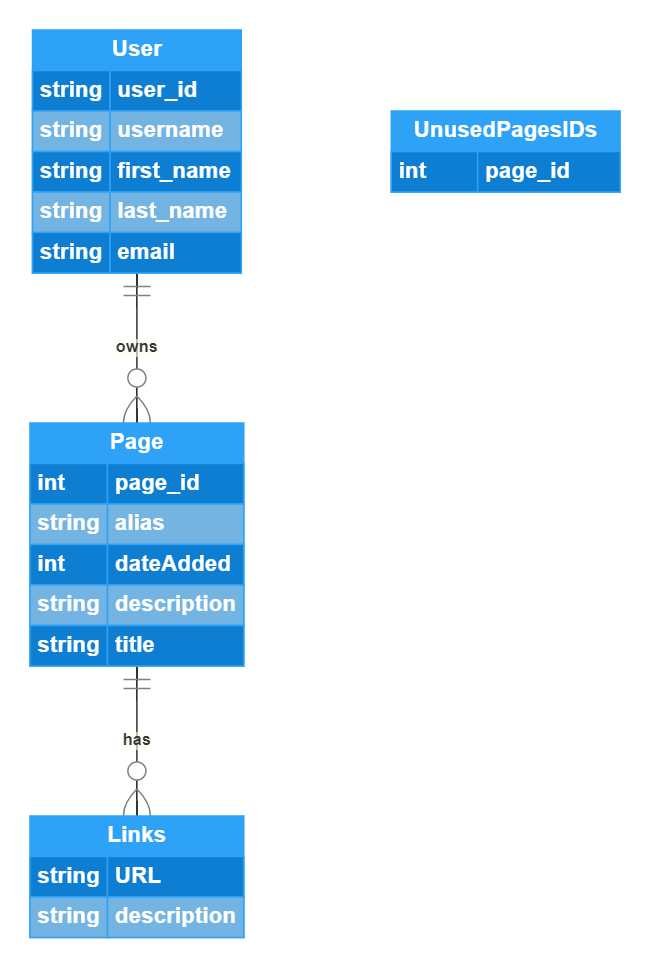

# Requirements
## Basic Requirements

- A user should be able to create a page where they can easily post links and share it with others.
- The links on that page will have previews rendered for them.
    - Optionally, the user can toggle the view to display it as an ordered list
- The URLs should be automatically generated when you just want to create a new page, and they should be random.
    - This is because we don't want people to be able to easily browse the pages people make without them sharing it. 
    - e.g people could create a page and look at the page id and then check page_id - 1 to view the last created page.
- A user should be able to optionally pick a custom URL for that page
    - 16 character custom URL.
- The created page should have a customizable title and description. (TBD if links should have description? Decide during development)
- The user should be able to login and edit the page after initial publishing.
    - Initially will use google login, might extend to include non-google based auth.

## Educational Requirements

- The backend should be written in golang :)
- The API should be available through graphql
- Database should be mongodb

## Extended (optional) Requirements

- Link pages can be exported as a bookmark folder
- The docker containers should be migrated to kubernetes for deployment
- Page URLs will only last 10 years from initial creation. Afterwards it will be pruned from the db.
- Users can create private pages that are only viewable by users they share it to.

# Unique URLs 

## First approach
- We can use a key generation service that pre-generates keys which we can sample randomly to provide unique URLs. 
- We'd want to use a 64 base encoding to minimize storage ([a-zA-Z0-9\-_]). Each character would be 6 bits (64 = 2^6)
- 16 character custom URLs would mean we'd have 64^16 ~~= 10^29 possible strings
- That's way too much to pre-generate, so instead we can pre-generate 5-character URLs and alias the custom URLs to them. 
    - 5 character string = 30 bits to encode = 4 bytes of storage
    - 4 bytes * 64^5 possible strings = 4.29GB of storage
- We can index pages by both alias and key_id for quick lookup since the pages will be read heavy.
- 64^5 ~= 1 billion pages. If pages expired after 10 years, then the amount of pages per month we could tolerate is:
    - 64^5 pages / (10 years * 12 months/year ) ~= 9 million pages created per month that we could tolerate. Probably will never reach that.
    - 64^4 pages / 120 months ~= 140k pages per month.
    - I'd say we want to manage at most 10k new pages per month.
        - So we'd have 10k * 12 * 10 = 1.2 million pages

- We can generate more pages if the site grows
    - We'd need to generate new page ids, but it's possible that the new page_ids in base64 has been reserved as custom URL...
    - So the migration would need to check if the encoded URL is taken as an aliases and skip the decoded page #s that map to a taken URL

## Second approach

- We just address the pages under a username like /username/page_id, so the page URLs between users won't conflict.
- Since the pages per user would be pretty small, we could just randomly generate a url and check for uniqueness.
- In vast majority of cases it would be unique on first iteration if we used a 6 character url since there would be 64^6 possible strings and maybe 1000 pages max per user.
- This just isn't as great a user experience because the whole point is to create a short, shareable URL to a page of URLs and now they're a whole username longer
- It also bleeds a username to the general public after generating that page. 
- The upside is that this is a lot simpler and gives the user more flexibility in naming their page.

## Decision

Going with first approach because simple sharable links is kind of the whole point.

# Bottlenecks

## Generating a random URL
- Getting a random, unique URL is actually really slow at larger scales because we would need to sample from the set of URLs which haven't been taken. 
    - To get a properly random URL, we'd want to choose randomly from larger samples. 
        - The reason is because if we take a smaller sample, the sample will be ordered by an index (the page id). 
        - The smaller the sample, the more 'tailed' the distribution will be towards the bottom of the index

- We can solve this by instead keeping the pages which haven't been used in a separate collection. 
- Then we can just sample from this collection and quickly get a new page.

## Quick reads

- The application will be read heavy, and we want to optimize for the most common case.
- Some of the pages might be a lot more interesting than others. It's possible 20% of the pages might actually account for 80% of the traffic. 
- We can cache the most frequently used requests in memory so that we don't have to query the DB. 

# Data Model

