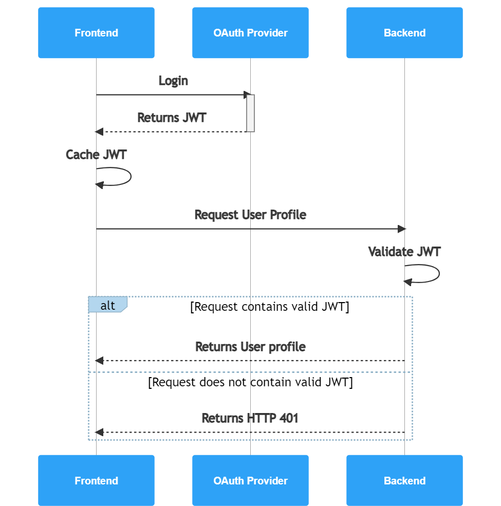
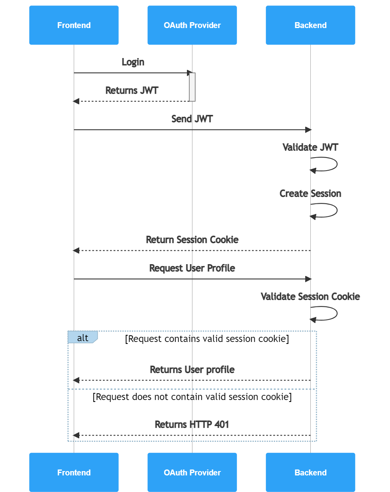

# Requirements
## Basic Requirements

- A user should be able to create a page where they can easily post links and share it with others.
- The links on that page will have previews rendered for them.
    - Optionally, the user can toggle the view to display it as an ordered list
- The URLs should be automatically generated when you just want to create a new page, and they should be random.
    - This is because we don't want people to be able to easily browse the pages people make without them sharing it. 
    - e.g people could create a page and look at the page id and then check page_id - 1 to view the last created page.
- A user should be able to optionally pick a custom URL for that page
    - 16 character custom URL.
- The created page should have a customizable title and description. (TBD if links should have description? Decide during development)
- The user should be able to login and edit the page after initial publishing.
    - Initially will use google login, might extend to include non-google based auth.

## Educational Requirements

- The backend should be written in golang :)
- The API should be available through graphql
- Database should be mongodb

## Extended (optional) Requirements

- Link pages can be exported as a bookmark folder
- The docker containers should be migrated to kubernetes for deployment
- Users can create private pages that are only viewable by users they share it to.
- Users can extend editing privileges on their page to other users with the link or to specific accounts.
- ~~Page URLs will only last 10 years from initial creation. Afterwards it will be pruned from the db.~~
    - Edit: This is actually trivial to implement in mongodb. I will only bother doing this if there at some point becomes a need to reduce storage.
- Add viewcount to pages (should cache IP so that one person can't increase viewcount for some amount of time)
# Unique URLs 

## First approach - minimizing storage while maximizing read response times
- We can use a key generation service that pre-generates unique keys offline. We can sample those keys randomly to quickly provide a URL at runtime. 
- We'd want to use a 64 base encoding to minimize storage ([a-zA-Z0-9\-_]). Each character would be 6 bits (64 = 2^6)
- 16 character custom URLs would mean we'd have 64^16 ~~= 10^29 possible strings
- That's way too much to pre-generate, so instead we can pre-generate 5-character URLs and alias the custom URLs to them. 
    - 5 character string = 30 bits to encode = 4 bytes of storage
    - 4 bytes * 64^5 possible strings = 4.29GB of storage

- 64^5 ~= 1 billion pages. If pages expired after 10 years, then the amount of pages per month we could tolerate is:
    - 64^5 pages / (10 years * 12 months/year ) ~= 9 million pages created per month that we could tolerate. Probably will never reach that.
    - 64^4 pages / 120 months ~= 140k pages per month.
    - I'd say we want to manage at most 10k new pages per month.
        - So we'd have 10k * 12 months * 10 years = 1.2 million pages over the 10 years before they'd get removed

- URL aliases will be decoded into binary from base64. 
    - It's probably fine to enforce that the URL be composed of base64 characters for simplicity.
    - On page creation, if the decoded string doesn't fit into 32 bits, then we just assign it a random page ID.
    - Whenever there is an alias, the alias will be the only valid URL. 
    - When a page is requested at a URL we check if the decoded URL fits into 32 bits.
        - If it doesn't fit into 32 bits, we just match the URL against the aliases.
        - If it fits into 32 bits, we match against the decoded ID
    - We can index pages by both alias and page_id for quick lookup since the pages will be read heavy.

- We can generate more pages if the site grows
    - We'd need to generate new page ids, but it's possible that the new page_ids are reserved as a custom URL
    - So the migration would need to check if the generated IDs are taken in the pages collection.

- We'd also probably want to encode the links on a page using something like a huffman encoding to save space since links will probably be the bulk of the data on a page

### Generating a random URL
- Getting a random, unique URL can get really slow at larger scales because we would need to sample from the set of URLs which haven't been taken, and that set can potentially be quite big if we pre-generate a lot of pages.
    - If we instead sampled from a small amount of the free URLs, that would work but only if the URLs are already randomly distributed. 
        - Otherwise, when we sample, they will only be distributed randomly amongst the first n IDs which won't be as random.
        - The smaller the sample, the more 'tailed' the sampled distribution will be towards the bottom of the natural ordering of documents (by id)
- We can shuffle the initial set of documents to get around this
    - Doing a db.pages.aggregate([{$sample: {size: large_number}}, {$out: {db: "links", coll: "newCol"}}], {allowDiskUse: true}) can take a while, won't fit into memory. 
    - I would prefer to just keep it as simple as possible to just spin up a couple docker containers and immediately have something working without any kind of complicated start-up scripts or whatever to generate a random natural ordering.
    - Later on it's possible the natural ordering might change but as long as it's not ordered by ID it should be good enough.
- A great solution would be to just randomly choose a number n before we do the query, and then skip the first n documents when we search for the pages which haven't been used. This way our results won't be biased towards the tails of our unused page ID distribution.
    - Unfortunately the implementation of this on mongodb is that it iterates through n elements instead of just starting the aggregation from the nth element. This ends up being slow.
- The most scalable solution is to just keep the pages which haven't been used in a separate collection. 
    - Then we can sample from this collection and quickly get a new page since we can freely sample on n documents without having to search for those unused documents first.
    - The downside of this is the added complexity. I'd prefer to keep the pages together since they are accessed together whenever a user creates a new page. Now page creation might take multiple operations.

- I think the best approach is to just keep the unused page IDs in a different collection. I probably won't need to worry about this kind of performance at the current scale, but the solution has negligible downsides.

### Evaluation

- This approach was fun to think through, but:
    1. It ends up being slower than I thought. Since moving pages around different collections can't be done in a single operation as far as I know, it takes many operations to create a page. So you need to sample a url randomly using an aggregation, then delete it from the unused page ID collection, then insert it into the pages collection... 
    2. It's definitely overly complex. In reality storage on aws will be really cheap, and we don't need to encode the URLs, and there won't be a need to worry about scaling so much :)

## Second approach - storage is cheap! Keep it simple

- We could just randomly generate a url and check for uniqueness.
- If the generated url is taken, we just retry.
- If we address the pages under a username like /username/page_id, so the page URLs between users won't conflict.
    - But we'd prefer to just have the pages separate from the usernames
    - We want the urls to be consistent - domain/my_page or domain/pages/my_page. 
    - We also want to keep the pages decentralized instead of having them appear under a user. 
    - That's because we might want multiple users to be able to edit a page (although it would be owned by only one person)
- We can just generate a random 6 character string. 
    - The chances of having a collision given a randomly chosen string is incredibly small. 
    - Let's use a character set like before (([a-zA-Z0-9\-_])) - 64 possible characters
    - We'd have 64^6 possible strings.
    - Even if we had 1.2 million pages, the chance that a new page would collide would be 1.2e6/64^6 = 1.75e-5
    - That's a 0.00175% chance
- The randomly generated page IDs would be up to 6 bytes, custom URLs would be up to 16 bytes in UTF-8.
- The db operations would be simple and fast. We wouldn't even need to do a find, we could leverage mongodb schema validation and just attempt an insert and re-try if it fails.

# Bottlenecks

## Quick reads

- The application will be read heavy, and we want to optimize for the most common case.
- Some of the pages might be a lot more interesting than others. It's possible 20% of the pages might actually account for 80% of the traffic. 
- We can cache the most frequently used requests in memory so that we don't have to query the DB. 

# Security 

## Sessions

OAuth APIs like google make it tempting to use the JWT given as a means of tracking the session. The following flow gives a potential means for making sessions completely "stateless":

When we need privileged access, we just send along the JWT with the request and the backend can validate the claims on the JWT on each request without any need for creating a session on the backend. This makes scaling a lot easier, since we don't need to worry about bottlenecks on the backend which can occur when you have to manage sessions on multiple instances of your backend running throughout the world. 

The problem with this flow is that [using JWTs for tracking user sessions is bad practice.](http://cryto.net/~joepie91/blog/2016/06/13/stop-using-jwt-for-sessions/)

Some key points (some mine, some from the above link): 
- JWTs are encrypted, but they're still access tokens which can be stolen and used to give privileged access to unauthorized parties.
- Therefore, it's not recommended to store them in localstorage since they will be vulnerable to cross site scripting (XSS) attacks. 
    - While it's true that if the site is vulnerable to XSS attacks we have bigger problems we can still limit the damage that an attacker can do through other means by keeping it in an httpOnly cookie. 
        - A malicious library or cdn script could steal your access token from localstorage, whereas this is not possible when stored in an httpOnly cookie. 
        - When malicious code is being ran, there are endless possible avenues for abuse and the situation is bad, but keeping our access tokens out of the hands of the attacker makes it harder for them to do damage. Regardless of there being vulnerabilities either way, we want to reduce our overall risk and attack surface.
        - For example, perhaps some library has some malicious code that listens to user keypresses to steal credentials and is reading our localstorage. In that case if the user logs in through OAuth and we use httpOnly cookies to store our sessions, then they won't succeed. 
    - Personally I also think it's more common that users will not think twice about giving browser plugins access to localstorage since sensitive content is not supposed to be stored there. Users might think "yeah i don't mind if you store stuff on my computer" whereas for cookies they might say "wait I don't know what this is or what risk it entails, let me gooogle if this is safe". This makes storing access tokens in localstorage more vulnerable to malicious browser plugins / extensions in my opinion. 
- We can't invalidate the JWT server side (at least without essentially reintroducing state thus defeating the purpose of this approach)
- JWTs are larger than session cookies which increases our bandwidth
- We have to decrypt JWTs on every request and verify the signature which is an additional unnecessary overhead.
- Not likely but it's theoretically possible to receive a JWT from an OAuth provider that won't fit into a cookie.

The flow that I'm opting to use is instead the following:

- For the purposes of this app, there's no real benefit to signing or encrypting the session ID. So the session cookies will remain small and easily processed.

- There is also the added benefit that after login, the process of validating the session cookie is the same regardless of however they logged in (don't have different JWTs or have to worry about generating my own JWT)

## CSRF tokens vs SameSite

One option to prevent csrf attacks is to issue csrf tokens which are random tokens that are generated on the backend and sent to the frontend. The frontend attaches these tokens to its requests, and the tokens get validated on the backend. 

Nowadays SameSite=strict can be used to generally prevent csrf attacks. But there are potentially usability issues with this solution. If a user is sent a link to an address which requires an authenticated cookie to view, then the cookie won't be sent and they won't have access to the page. When a cookie has set SameSite=Strict, when the website is accessed via a third-party context (a link from another site), the cookies are not sent. This would also mean that if a user is logged in and has 2 tabs open on your website and they open a link from another website to a new page, they're going to essentially start a new session. If you store all session information including auth in one cookie, then the user will essentially be logged out because they will receive a new session cookie when they click this link. 

SameSite=Lax is like SameSite=Strict, but it only sends cookies on "safe" http methods (GET, HEAD, OPTIONS, and TRACE). 

[There are some vulnerabilities with SameSite=Lax](https://datatracker.ietf.org/doc/html/draft-ietf-httpbis-rfc6265bis-02#section-5.3.7.1):

> Attackers can still pop up new windows or trigger top-level
       navigations in order to create a "same-site" request (as
       described in section 2.1), which is only a speedbump along the
       road to exploitation.

> Features like "<link rel='prerender'>" prerendering can be
       exploited to create "same-site" requests without the risk of user
       detection.

The prerender bug [seems to have been fixed](https://bugs.chromium.org/p/chromium/issues/detail?id=831725) in Chromium in 2019, so I assume that this isn't really a concern anymore for modern browsers. 

Since the GraphQL api only allows mutations on POST requests, SameSite=Lax is good enough protection against csrf attacks. CSRF tokens are generally more robust against csrf attacks, but I don't have any requirement for this level of robustness for the kind of site I'm building.

# Data Model

